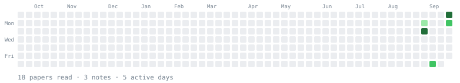

### Zihan Zhang

Undergrad at **Shanghai Jiao Tong University**. I work on making large models
cheaper to run — inference serving, KV cache, speculative decoding.

A lot of that turns out to be measurement: figuring out which reported speedup
survives contact with a real serving stack, and which one was an artifact of the
baseline it was measured against.

[Homepage](https://acm.sjtu.edu.cn/~tiancaizhangdaxian/) ·
[Email](mailto:tiancaizhangdaxian@sjtu.edu.cn) ·
[X](https://x.com/_SubSir)

---

<!-- reading-log:start -->

## What I'm reading

A daily log of LLM / ML-systems efficiency papers — inference serving, KV cache, speculative decoding, quantization, and whatever else makes models cheaper to run. Every paper is read in full text, not from the abstract.

**7** papers read · **0** notes · **2** active days · **2**-day streak

### Recent

### 2026-09-01

**6 papers read**

- 📄 [Efficient Long-Context Language Model Training by Core Attention Disaggregation (DistCA)](https://proceedings.mlsys.org/paper_files/paper/2026/hash/423b59ae02381f27862c21d1c41a5603-Abstract-Conference.html)
- 📄 [TeleRAG: Efficient Retrieval-Augmented Generation Inference with Lookahead Retrieval](https://proceedings.mlsys.org/paper_files/paper/2026/hash/7fd522b89ac21009b7bbe7560a9a5add-Abstract-Conference.html)
- 📄 [A Contract-Grade Verifier for LLM-Generated GPU Kernels, and a Native Blackwell Backward for the Gated-Linear-Recurrence Family](https://arxiv.org/abs/2608.12700)
- 📄 [Simple Is Better: Multiplication May Be All You Need for LLM Request Scheduling (LMetric)](https://www.usenix.org/conference/osdi26/presentation/zhang-dingyan)
- 📄 [Certifying Compressed Language Models: An Audit and a Statistical Toolkit](https://arxiv.org/abs/2608.15046)
- 📄 [A Full-Stack Characterization of High-Bandwidth Flash for KV-Centric LLM Serving](https://arxiv.org/abs/2608.11668)

### 2026-08-31

**1 paper read**

- 📄 [LEANN: A Low-Storage Overhead Vector Index](https://proceedings.mlsys.org/paper_files/paper/2026/hash/e27ea0cd50b798ff8942caf9203f0992-Abstract-Conference.html)

[Full log →](READING-LOG.md)

<!-- reading-log:end -->
