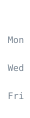

<!-- reading-log:start -->

## What I'm reading

A daily log of LLM / ML-systems efficiency papers — inference serving, KV cache, speculative decoding, quantization, and whatever else makes models cheaper to run. Every paper is read in full text, not from the abstract.

**18** papers read · **3** notes · **5** active days · **2**-day streak

### By topic

`vector-index` 1 · `cp-parallel-training` 1 · `rag-serving` 1 · `kernel-gen` 1 · `serving-sched` 1 · `compression-equivalence` 1 · `kv-tiering` 1 · `quantization-eval` 1 · `comm-overlap` 1 · `kv-compression` 1 · `tts-effectiveness` 1 · `moe-expert-prune` 1

### Recent

### 2026-09-21

**1 paper read · 1 note**

- 📄 [How Lossless Is Lossless Speculative Decoding? The Role of Numerical Precision in Orthrus](https://arxiv.org/abs/2609.15504)
- 💬 [How Lossless Is Lossless Speculative Decoding? The Role of Numerical Precision in Orthrus](https://arxiv.org/abs/2609.15504)

### 2026-09-20

**6 papers read · 2 notes**

- 📄 [Higher-order pruning of experts in mixture-of-experts language models (HOPE)](https://arxiv.org/abs/2609.18916)
- 📄 [Launch-Bound and Substitutable: Why Three Inference Optimizations Fail to Pay Off in Mixture-of-Experts Models](https://arxiv.org/abs/2608.26612)
- 📄 [A Calibrated Instrument for Measuring How Inference Optimizations Affect Output Quality](https://arxiv.org/abs/2609.18005)
- 📄 [When Token Pruning is Worse than Random: Understanding Visual Token Information in VLLMs](https://openaccess.thecvf.com/content/CVPR2026/html/Wang_When_Token_Pruning_is_Worse_than_Random_Understanding_Visual_Token_CVPR_2026_paper.html)
- 📄 [RetrievalAttention: Accelerating Long-Context LLM Inference via Vector Retrieval](https://papers.nips.cc/paper_files/paper/2025/hash/4e36d4049fb0fea195a8267c8dcd0824-Abstract-Conference.html)
- 📄 [The Embedder's Dilemma: LLMs Are Better, but at What Cost?](https://arxiv.org/abs/2608.12875)
- 💬 [Launch-Bound and Substitutable: Why Three Inference Optimizations Fail to Pay Off in Mixture-of-Experts Models](https://arxiv.org/abs/2608.26612)
- 💬 [The Embedder's Dilemma: LLMs Are Better, but at What Cost?](https://arxiv.org/abs/2608.12875)

### 2026-09-12

**2 papers read**

- 📄 [Random Attention: Rethinking KV Cache Eviction for Efficient Reasoning](https://arxiv.org/abs/2609.03430)
- 📄 [Kinetics: Rethinking Test-Time Scaling Law](https://proceedings.neurips.cc/paper_files/paper/2025/hash/79ada0f9bc4e41192ad5a80d13c8ca7e-Abstract-Conference.html)

### 2026-09-01

**8 papers read**

- 📄 [Efficient Long-Context Language Model Training by Core Attention Disaggregation (DistCA)](https://proceedings.mlsys.org/paper_files/paper/2026/hash/423b59ae02381f27862c21d1c41a5603-Abstract-Conference.html)
- 📄 [TeleRAG: Efficient Retrieval-Augmented Generation Inference with Lookahead Retrieval](https://proceedings.mlsys.org/paper_files/paper/2026/hash/7fd522b89ac21009b7bbe7560a9a5add-Abstract-Conference.html)
- 📄 [A Contract-Grade Verifier for LLM-Generated GPU Kernels, and a Native Blackwell Backward for the Gated-Linear-Recurrence Family](https://arxiv.org/abs/2608.12700)
- 📄 [Simple Is Better: Multiplication May Be All You Need for LLM Request Scheduling (LMetric)](https://www.usenix.org/conference/osdi26/presentation/zhang-dingyan)
- 📄 [Certifying Compressed Language Models: An Audit and a Statistical Toolkit](https://arxiv.org/abs/2608.15046)
- 📄 [A Full-Stack Characterization of High-Bandwidth Flash for KV-Centric LLM Serving](https://arxiv.org/abs/2608.11668)
- 📄 [Spec Sheets Are Not Kernels: An ISA- and Source-Level Audit of INT8 Availability on NVIDIA Blackwell Ultra](https://arxiv.org/abs/2608.11693)
- 📄 [TokenWeave: Efficient Compute-Communication Overlap for Distributed LLM Inference](https://proceedings.mlsys.org/paper_files/paper/2026/hash/73ba81c7b25134a559c8a9c39ec1a4c3-Abstract-Conference.html)

### 2026-08-31

**1 paper read**

- 📄 [LEANN: A Low-Storage Overhead Vector Index](https://proceedings.mlsys.org/paper_files/paper/2026/hash/e27ea0cd50b798ff8942caf9203f0992-Abstract-Conference.html)

[Full log →](READING-LOG.md)

<!-- reading-log:end -->
